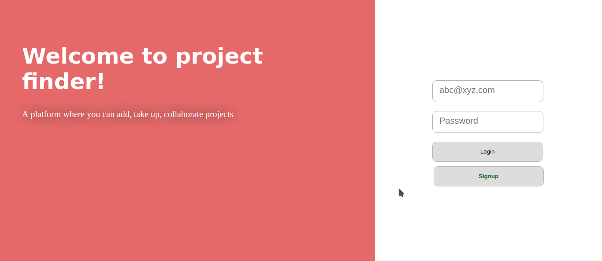
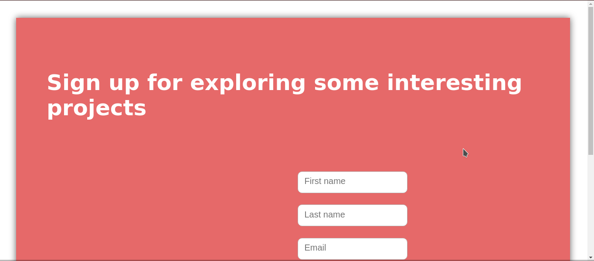
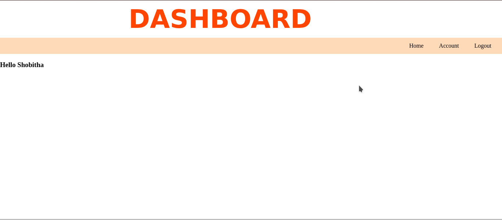
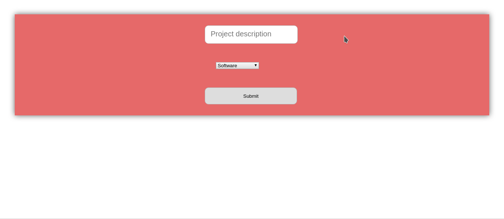
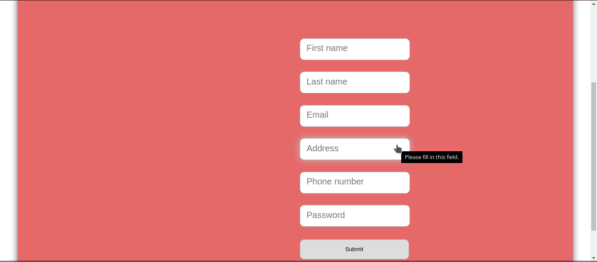

 
# Project Finder
### Purpose
This purpose of this project is to identify problems that go unnoticed most of the time. Problems ranging from water scarcity to income issues can be resolved by the students and professionals who use this application. 
### How it works
Students or professionals can signup the application and provide details like phone number and *location. On logging in, the user can view the projects whose location will be in the radius of 2kms from their location. We have planned to use HERE API to get nearby places, given the user's longitude and latitude.
When a find a problem in some place, he/she can add the problem as a project and provide the description, location and category(software, hardware, social) of the problem. 
### How and whom will it benefit
It will benefit the society in getting their issues solved. As students, it is our responsibility to contribute to the society for the betterment of our nation.
It will also benefit us as we are putting technology to good use.
### Screenshots

### Setting up
* Clone from https://github.com/massg/Project-Finder.git
* Install Node.js, ejs, MongoJS, express.
* Go to the directory- Project-Finder and run the following command: 
`node ProFin.js`